# Serverless API with Lambda, API Gateway, and Output Delivery with Amazon SES

## Description

This repository contains the executable code for my Serverless API, together with execution steps and setup to try on your own environment. This project configures AWS Lambda, Amazon API Gateway, and IAM using Terraform. This project's end goal is a fully provisioned, serverless HTTP API accessible via public URL, delivered and sent to your email address. Fully managed by Infrastructure as Code and deployed via GitOps principles

## Requirements

### Architecture Diagram

Here is the architecture diagram for this project:

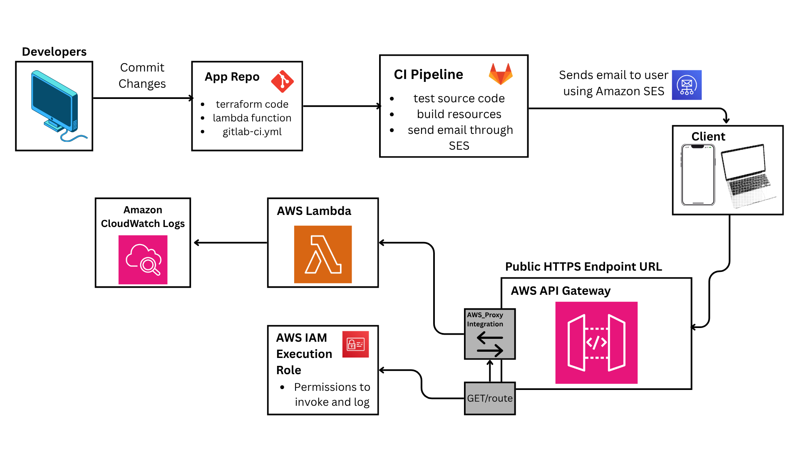

### Resources

1. AWS Lambda
2. AWS Lambda Function File
3. AWS API Gateway
4. IAM Execution Role
5. IAM Policy Attachment

### Prerequisites

1. GitLab Environment Variables Setup
2. Manually provisioned S3 Bucket for statefile and statelock
3. Fully Setup Amazon SES

## Execution

### Statefile Storage and Locking

>[!NOTE]
>If you have an existing s3 bucket provisioned, you can skip this part

We will set up an S3 bucket to store our statefile and statelock. Run the `statefile-locking` configuration file using the following execution commands:

    ```bash
    # change directory
    cd statefile-locking

    # This command will initialize your folder and terraform to install the necessary extensions for the task required.
    terraform init

    # This command will layout all the resources that terraform will deploy in your AWS account. 
    terraform plan

    # After making sure you are deploying the correct resources, execute this command to deploy all the resources to your AWS Account.
    terraform apply
    ```

>[!WARNING]
>Before executing terraform init, ensure that you already have terraform set up in your local device, otherwise, it will not work

>[!NOTE]
>Before executing terraform plan, ensure that you already have your Access Key and Secret Access Key ready. It will be asked during the running process for security measures.

If you don't have `terraform` set up in your local device, follow this documentation:

:point_right: [Install Terraform](https://developer.hashicorp.com/terraform/tutorials/aws-get-started/install-cli)

Here are the expected output after `terraform apply`:

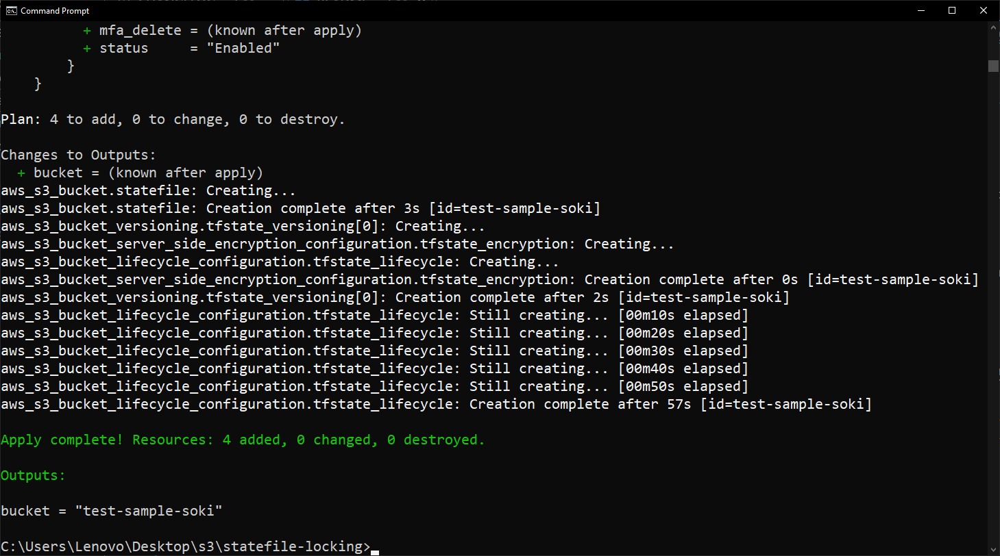

> Make sure to save the output of your apply as it will be used for the backend configuration of the system.

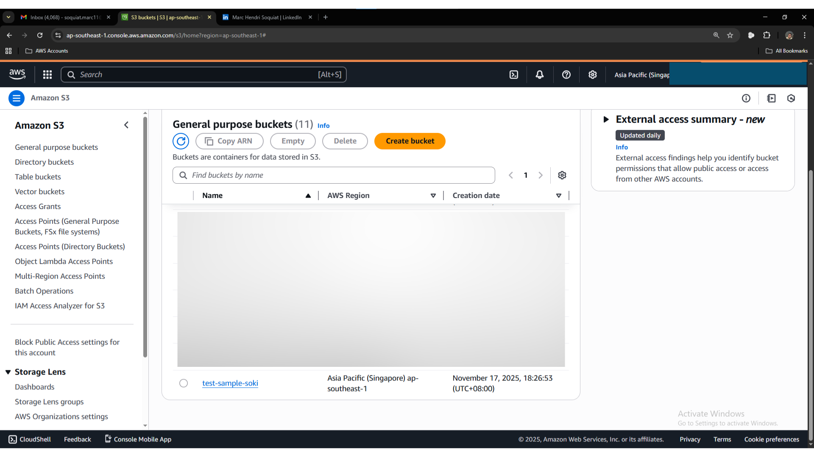


### Amazon SES Setup

To setup your Amazon SES, follow this steps:

1. Navigate to Amazon Simple Email Service in your AWS Management Console and you will be prompted to the screen below, and click Get Started:


2. Once you click get started, you will be prompted to this screen where you will provide a valid email address, one where you can verify. Click Next once you're finished filling out your email address.

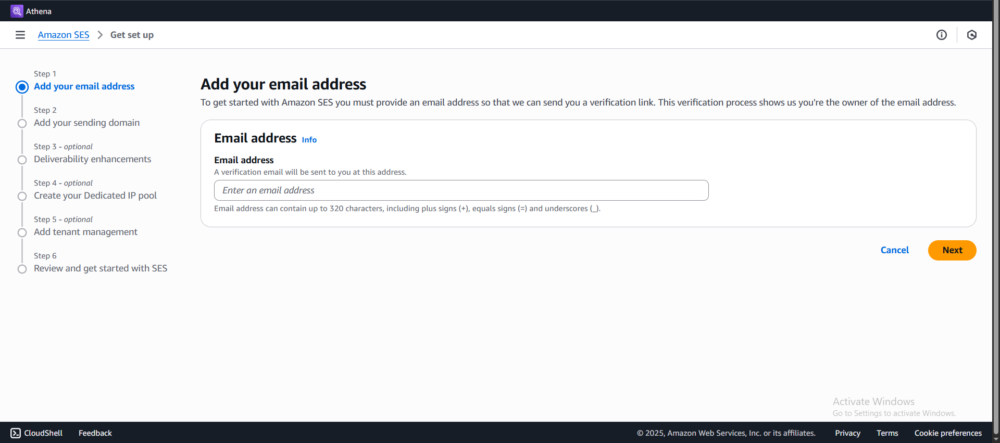

3. For the next page, you will be tasked to enter your domain. Please do so.

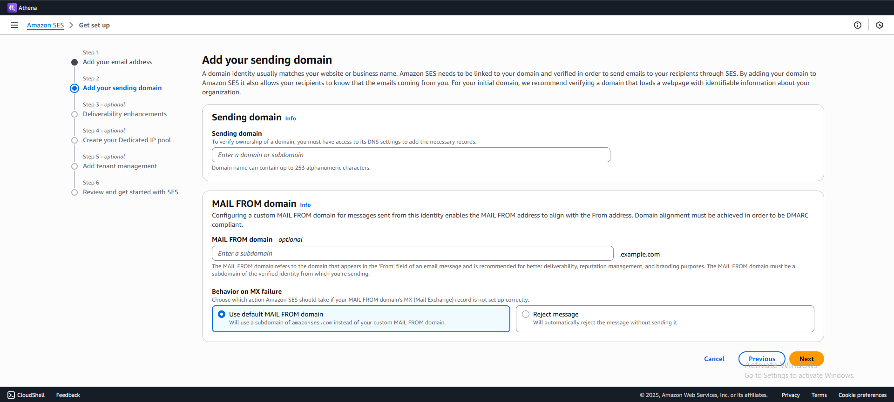

>[!NOTE]
>If you don't have your own domain, it's okay, just enter a random unique domain, using the verified email is enough to successfully demonstrate this project. 

4. For steps 3-5, you don't have to change anything and just press next until you reach step 6, where you will have to review the details of your setup. Once you confirmed that everything is good and accurate, you can proceed to get started with Amazon SES.

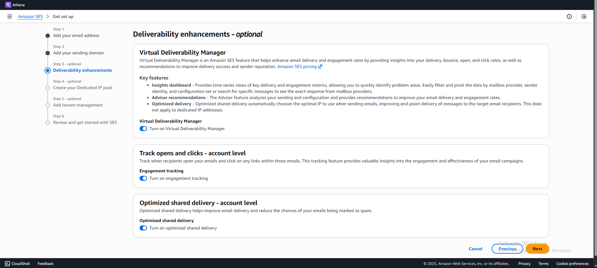

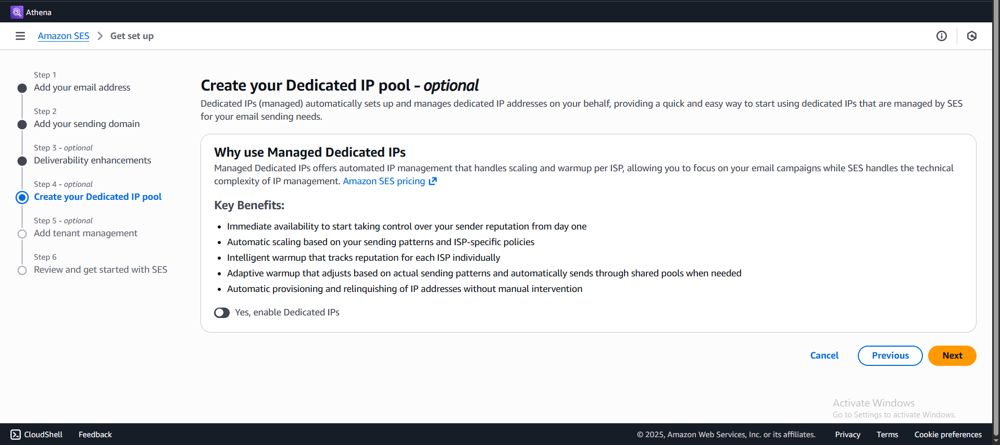

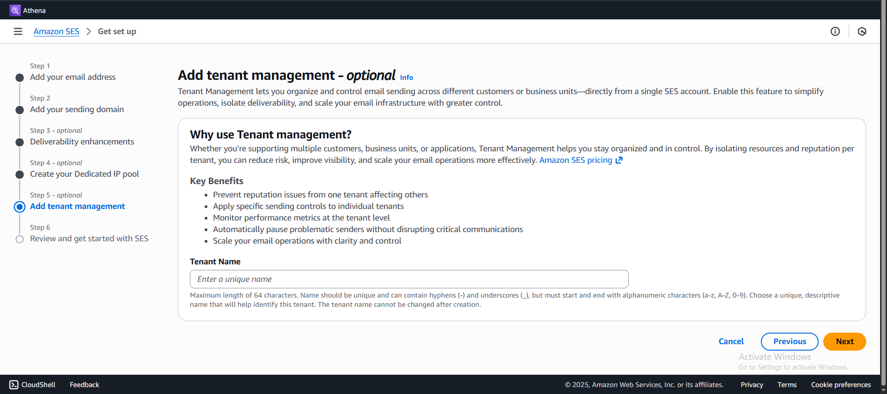

### GitLab Setup

For this section, we will set up the environment variables needed for this project. But first, we will gather the needed variables: Access Key and Secret Access Key, and Amazon SES SMTP Credentials.

**Access Key and Secret Access Key**

1. Head over to your AWS Management Console and navigate to IAM Users, and create a user:

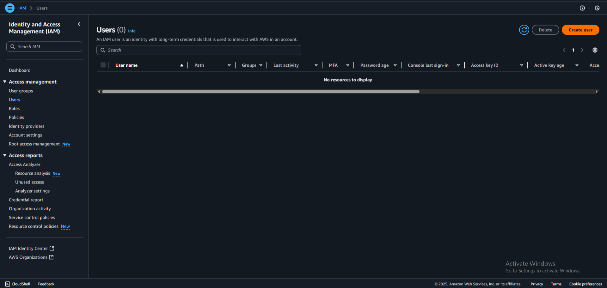

2. As Terraform interacts with various cloud providers such as AWS, it is important to verify your identity with Terraform. That is what we’re going to do. We are going to set up Authentication and Authorization using AWS IAM. First, name your user. I used my nickname here “Soki”

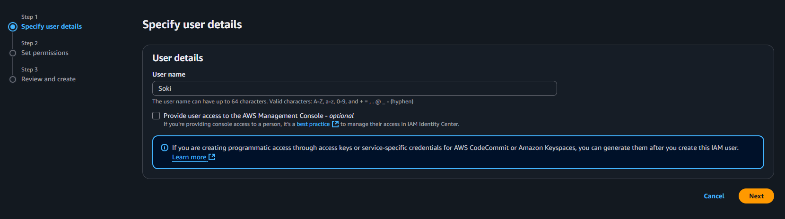

3. Next, we are going to set permissions. We will give this user the AdministratorAccess for now, as this is my personal account and we want the flexibility to provision any AWS resources for this demo. However, if you want to limit the access and authorization of the user you’re creating, please apply the minimum access as possible.

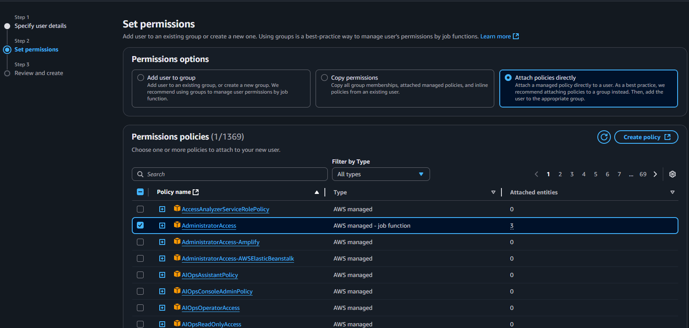

4. Review the permissions that you have given, once everything is okay, press create user to create the user.

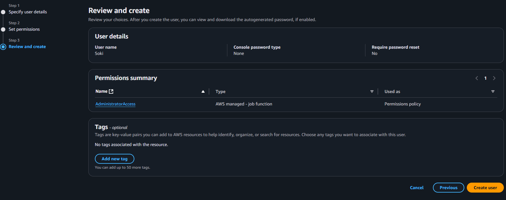

5. Navigate to your user and press Create Access Key

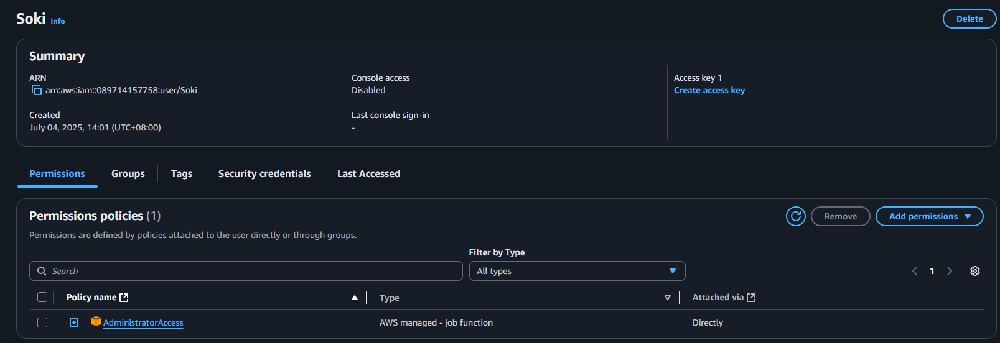

6. Select Command Line Interface, and tick the confirmation checkbox at the bottom and click next.

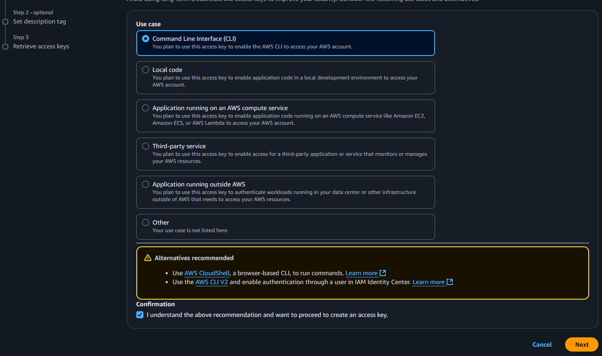

7. Click create access key and you should be prompted to the retrieve your access keys. Save your access key and secret access key to your Local Device or Password Managers.

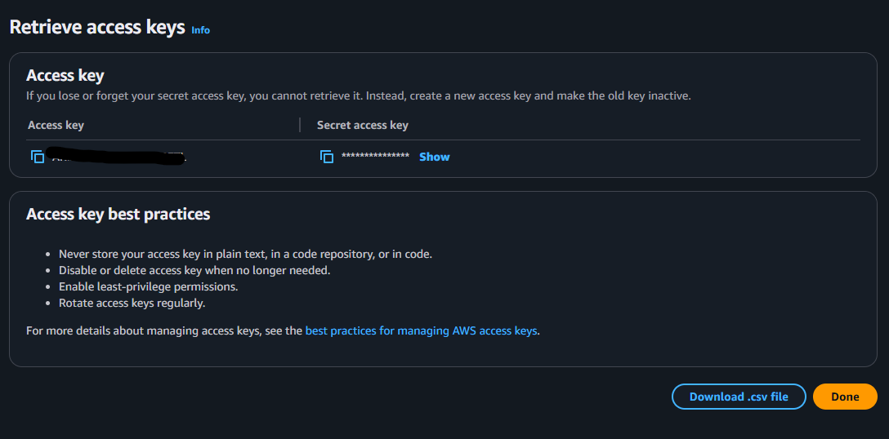

**Amazon SES**

Here are the environment variables we will be getting in Amazon SES:
- SES_SMTP_USERNAME
- SES_SMTP_PASSWORD
- SES_FROM_EMAIL
- SES_TO_EMAIL
- SES_REGION

1. For SES_SMTP_USERNAME adn SES_SMTP_PASSWORD, navigate to Amazon SES > SMTP Settings > Create SMTP Credentials:

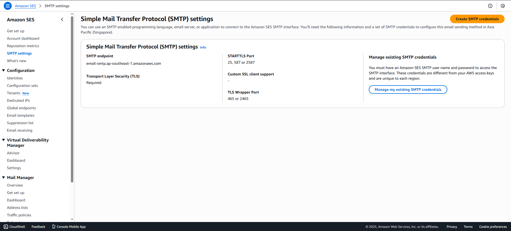

Retrieve and save the information for now. 

>Choose your own username or let SES randomly generate it for you.

2. SES_FROM_EMAIL = Email that you input earlier in setting up Amazon SES. This needs to be verified

3. SES_TO_EMAIL = Navigate to Identities, and input another email that you can verify. 

4. SES_REGION, the region where you set up your Amazon SES.

**GitLab Variables**

After setting up your GitLab repository, navigate to your project settings. Under settings, head over to CI/CD > Variables. Press Add Variables, input these following keys, and input their respective values from the previous steps:

- AWS_ACCESS_KEY_ID
- AWS_SECRET_ACCESS_KEY
- SES_FROM_EMAIL
- SES_REGION
- SES_SMTP_PASSWORD
- SES_SMTP_USERNAME
- SES_TO_EMAIL

[!GitLab Env Var](./output/gitlab/2.png)

### Running the Pipeline

To test the pipeline, create a change in the AWS Lambda Configuration in the main configuration file. Change the message of the greetings to your preference. Once you created a commit and pushed it to the origin, the pipeline will run. Here are the expected outputs:

**Email Notification**:
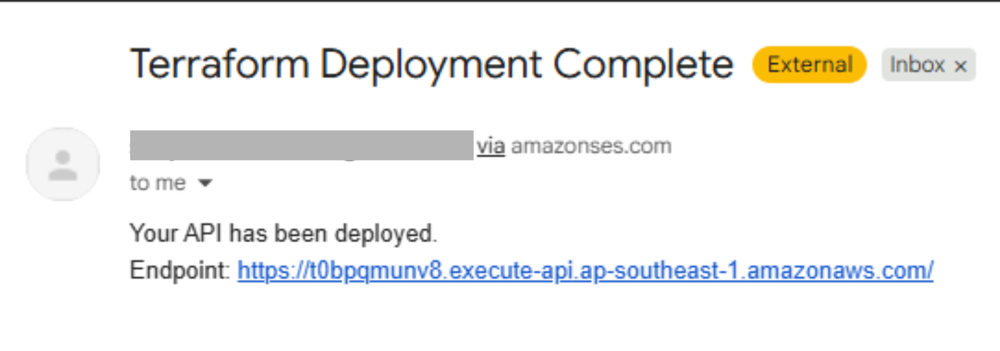

**Public API Endpoint URL**:

[API ENDPOINT URL](https://t0bpqmunv8.execute-api.ap-southeast-1.amazonaws.com/)

**CloudWatch Livetrail**:

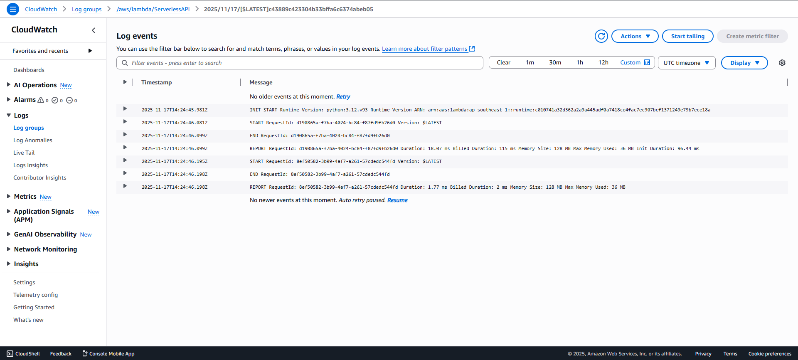

## Features

Test the following features for this System:

- [ ] Successful delivery of email to your chosen recipient
- [ ] Access the Public HTTP Endpoint URL and see the message
- [ ] CloudWatch Logs and Live Trail
- [ ] Change the message of the API in the Lambda Function and observe the pipeline

> This project is continuously updated and maintained to accommodate changes in AWS and Terraform

If you like this project, let's connect on the following social media platforms:
- :point_right: [LinkedIn](https://www.linkedin.com/in/soqwapo/)
- :point_right: [Instagram](https://www.instagram.com/soqwapo/)